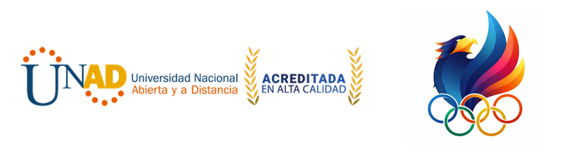

  

# Nombre del proyecto

> Maratón de Innovación en Narrativas Digitales · Segundas Olimpiadas Unadistas 2026 · Fase zonal

| Campo | Respuesta |
|---|---|
| Equipo | Neuronova|
| Zona / Centro(s) | ZCar/cartagena de indias|
| Tipo de producto (Tabla 1 del documento técnico) | |
| Integrantes (solo nombres completos) | Yeisy camila ortiz ruiz , Kerlin gomez garcias, Andrea guadalupe velez soto |
| Enlace al demo web (si aplica) |file:///C:/Users/USUARIO/neuro%20juega.html| 

**No escriba aquí cédulas, teléfonos ni correos.** Este repositorio se hace público el viernes 9 de octubre a las 12:00 m.

## ¿De qué trata? (máximo 5 líneas)
El juego se trata de medir el nivel de honestidad y empatia entra mas verde este la barra mejor sera el nivel de decisiones que el estudiante como lider debe de formular se trata de guuiar a aun equipo de manera empatica y honesta para que en la entrega sea el reconocimiento no solo para una persona si no para todo el equipo las personas un lideres debe de aprender a ser honesto y empatico con cada una de sus acciones y eso es lo que demuestra con colometria el puntaje y nivel de empatia que tiene la persona lider de no ser asi saldra lo contrario la barra mas para el rojo un puntaje bajo.
## Cómo ver o probar el producto

- **Demo web:** si su producto se ve en el navegador (web, scrollytelling, WebGL), ponga los archivos en la carpeta `docs/`, con un `index.html` en `docs/`. Quedará en `https://u-nacional-abierta-y-a-distancia.github.io/<nombre-de-este-repositorio>/`.
- **Archivos pesados** (video del pitch, builds, audio): van en el Release **entrega-zonal** (botón *Releases*, a la derecha).
- Instrucciones para ejecutarlo (si aplica):

## Créditos de recursos de terceros

| Recurso | Autor | Licencia o autorización |
|---|---|---|
| | | |

## Derechos

Todos los derechos reservados a sus autores. Publicado por la Universidad Nacional Abierta y a Distancia (UNAD) con autorización de los autores, conforme a la sección 7 del formato de identificación de la maratón.
